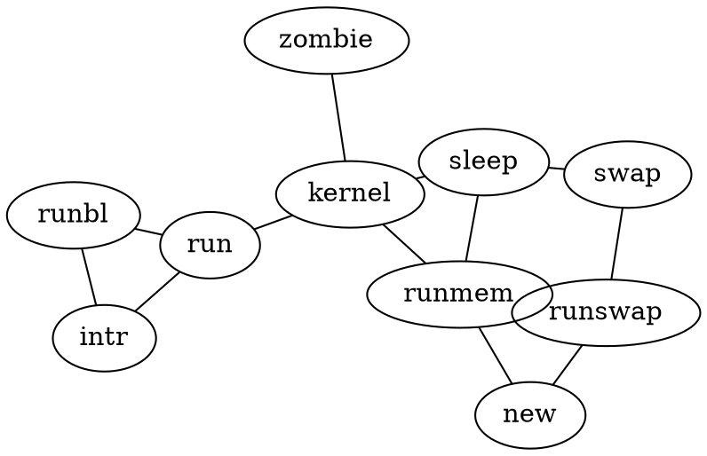

This document demonstrates various components available in Quarto.

Heading 1 is bolded and used as the title of the page.

# Heading 1

``` md
# Heading 1
```

Heading 2 is thined and used to introduce a new section or topic within a page.

## Heading 2

``` md
## Heading 2
```

Heading 3 is bolded and used to introduce a new subsection or subtopic within a page.

### Heading 3

``` md
### Heading 3
```

Headings 4, 5 and 6 are inceasing smaller and can be used as need after heading 3.

#### Heading 4

##### Heading 5

###### Heading 6

``` md
#### Heading 4
##### Heading 5
###### Heading 6
```

> All heading are enforced as **sentence case**.

## Text Formatting

**Bold Text**  
*Italic Text*  
~~Strikethrough~~  
`Inline Code`

superscript<sup>2</sup> / subscript<sub>2</sub>

``` md
**Bold Text**  
*Italic Text*  
~~Strikethrough~~  
`Inline Code`

superscript^2^ / subscript~2~
```

## Lists

### Ordered List

1. First item
2. Second item
3. Third item

``` md
1. First item
2. Second item
3. Third item
```

### Unordered List

- Item 1
- Item 2
- Item 3

``` md
- Item 1
- Item 2
- Item 3
```

- unordered list
  - sub-item 1
  - sub-item 2
    - sub-sub-item 1

``` md
* unordered list
    + sub-item 1
    + sub-item 2
        - sub-sub-item 1
```

- item 2

    Continued (indent 4 spaces)

``` md
*   item 2

    Continued (indent 4 spaces)
```

1. A list which numbering

continues after

1. an interruption

``` md
(@)  A list which numbering

continues after

(@)  an interruption
```

### Tasks

- [ ] Task 1
- [x] Task 2

``` md
- [ ] Task 1
- [x] Task 2
```

## Blockquotes

### `>` Blockquote

> This is a blockquote.  
> It can span multiple lines.

``` md
> This is a blockquote.  
> It can span multiple lines.
```

### Line Block

Line Block  
  Spaces and newlines  
  are preserved

``` md
| Line Block
|   Spaces and newlines
|   are preserved
```

## Footnotes

Here is a footnote reference,[^1] and another.[^2]

This paragraph won't be part of the note, because it
isn't indented.

Here is an inline note.[^3]

``` md
Here is a footnote reference,[^1] and another.[^longnote]

[^1]: Here is the footnote.

[^longnote]: Here's one with multiple blocks.

    Subsequent paragraphs are indented to show that they
belong to the previous footnote.

        { some.code }

    The whole paragraph can be indented, or just the first
    line. In this way, multi-paragraph footnotes work like
    multi-paragraph list items.

This paragraph won't be part of the note, because it
isn't indented.

Here is an inline note.^[Inlines notes are easier to write,
since you don't have to pick an identifier and move down to
type the note.]
```

## Tables

### Default

| Header 1 | Header 2 | Header 3 |
|----------|----------|----------|
| Row 1    | Data 1   | Data 2   |
| Row 2    | Data 3   | Data 4   |

``` md
| Header 1 | Header 2 | Header 3 |
|----------|----------|----------|
| Row 1    | Data 1   | Data 2   |
| Row 2    | Data 3   | Data 4   |
```

### Column Aligned

| Default | Left | Right | Center |
|---------|:-----|------:|:------:|
| 12      | 12   |    12 |   12   |
| 123     | 123  |   123 |  123   |
| 1       | 1    |     1 |   1    |

``` md
| Default | Left | Right | Center |
|---------|:-----|------:|:------:|
| 12      | 12   |    12 |   12   |
| 123     | 123  |   123 |  123   |
| 1       | 1    |     1 |   1    |
```

### Pipe Format

| fruit  | price |
|--------|------:|
| apple  |  2.05 |
| pear   |  1.37 |
| orange |  3.09 |

Demonstration of pipe table syntax

``` md
fruit| price
-----|-----:
apple|2.05
pear|1.37
orange|3.09

: Demonstration of pipe table syntax
```

### Pipe Format Striped

| fruit  | price |
|--------|-------|
| apple  | 2.05  |
| pear   | 1.37  |
| orange | 3.09  |

Fruit prices

``` md
| fruit  | price  |
|--------|--------|
| apple  | 2.05   |
| pear   | 1.37   |
| orange | 3.09   |

: Fruit prices {.striped .hover}
```

### Pipe Format Custom Col widths

| fruit  | price |
|--------|-------|
| apple  | 2.05  |
| pear   | 1.37  |
| orange | 3.09  |

Fruit prices

``` md
| fruit  | price  |
|--------|--------|
| apple  | 2.05   |
| pear   | 1.37   |
| orange | 3.09   |

: Fruit prices {tbl-colwidths="[75,25]"}
```

### Grid Table

<table style="width:62%;">
<caption>Sample grid table.</caption>
<colgroup>
<col style="width: 16%" />
<col style="width: 16%" />
<col style="width: 29%" />
</colgroup>
<thead>
<tr>
<th>Fruit</th>
<th>Price</th>
<th>Advantages</th>
</tr>
</thead>
<tbody>
<tr>
<td>Bananas</td>
<td>$1.34</td>
<td><ul>
<li>built-in wrapper</li>
<li>bright color</li>
</ul></td>
</tr>
<tr>
<td>Oranges</td>
<td>$2.10</td>
<td><ul>
<li>cures scurvy</li>
<li>tasty</li>
</ul></td>
</tr>
</tbody>
</table>

``` md
+-----------+-----------+--------------------+
| Fruit     | Price     | Advantages         |
+===========+===========+====================+
| Bananas   | $1.34     | - built-in wrapper |
|           |           | - bright color     |
+-----------+-----------+--------------------+
| Oranges   | $2.10     | - cures scurvy     |
|           |           | - tasty            |
+-----------+-----------+--------------------+

: Sample grid table.
```

## Cross Reference

<div id="tbl-letters">

| Col1 | Col2 | Col3 |
|------|------|------|
| A    | B    | C    |
| E    | F    | G    |
| A    | G    | G    |

Table 1: My Caption
</div>

See <a href="#tbl-letters" class="quarto-xref">Table 1</a>.

``` md
| Col1 | Col2 | Col3 |
|------|------|------|
| A    | B    | C    |
| E    | F    | G    |
| A    | G    | G    |

: My Caption {#tbl-letters}

See @tbl-letters.
```

### Subtables

<div id="tbl-panel">

<table>
<colgroup>
<col style="width: 50%" />
<col style="width: 50%" />
</colgroup>
<tbody>
<tr>
<td style="text-align: center;"><div width="50.0%" data-layout-align="center">
<div id="tbl-first">
<table>
<thead>
<tr>
<th>Col1</th>
<th>Col2</th>
<th>Col3</th>
</tr>
</thead>
<tbody>
<tr>
<td>A</td>
<td>B</td>
<td>C</td>
</tr>
<tr>
<td>E</td>
<td>F</td>
<td>G</td>
</tr>
<tr>
<td>A</td>
<td>G</td>
<td>G</td>
</tr>
</tbody>
</table>
(a) First Table
</div>
</div></td>
<td style="text-align: center;"><div width="50.0%" data-layout-align="center">
<div id="tbl-second">
<table>
<thead>
<tr>
<th>Col1</th>
<th>Col2</th>
<th>Col3</th>
</tr>
</thead>
<tbody>
<tr>
<td>A</td>
<td>B</td>
<td>C</td>
</tr>
<tr>
<td>E</td>
<td>F</td>
<td>G</td>
</tr>
<tr>
<td>A</td>
<td>G</td>
<td>G</td>
</tr>
</tbody>
</table>
(b) Second Table
</div>
</div></td>
</tr>
</tbody>
</table>

Table 2: Main Caption

</div>

See <a href="#tbl-panel" class="quarto-xref">Table 2</a> for details, especially <a href="#tbl-second" class="quarto-xref">Table 2 (b)</a>.

``` md
::: {#tbl-panel layout-ncol=2}
| Col1 | Col2 | Col3 |
|------|------|------|
| A    | B    | C    |
| E    | F    | G    |
| A    | G    | G    |

: First Table {#tbl-first}

| Col1 | Col2 | Col3 |
|------|------|------|
| A    | B    | C    |
| E    | F    | G    |
| A    | G    | G    |

: Second Table {#tbl-second}

Main Caption
:::

See @tbl-panel for details, especially @tbl-second.
```

## Links & Images

### Links

[GRASS Website](https://grass.osgeo.org)

``` md
[GRASS Website](https://grass.osgeo.org)
```

### Images

<figure>

<figcaption aria-hidden="true">Width 25%</figcaption>
</figure>

``` md
{width=25%}
```

<figure>

<figcaption aria-hidden="true">Width 50%</figcaption>
</figure>

``` md
{width=50%}
```

<figure>

<figcaption aria-hidden="true">Width 75%</figcaption>
</figure>

``` md
{width=75%}
```

<figure>

<figcaption aria-hidden="true">Width 100%</figcaption>
</figure>

``` md
{width=100%}
```

### Image Link

<figure>
<a href="https://grass.osgeo.org"></a>
<figcaption>Caption</figcaption>
</figure>

``` md
[{width=20%}](https://grass.osgeo.org)
```

### Image Link with Alt-Text

<figure>
<a href="https://grass.osgeo.org"></a>
<figcaption>Caption</figcaption>
</figure>

``` md
[{width=20%}](https://grass.osgeo.org)
```

### Aligned Images


``` md
{width=20% fig-align="left"}
{width=20% fig-align="right"}
```

### Lightbox

<figure>

<figcaption aria-hidden="true">Lightbox</figcaption>
</figure>

``` md
{width=20% fig-align="center" .lightbox}
```

### Placeholders


``` md
<!-- Uses placeholder shortcode -->
data:image/svg+xml;base64,PHN2ZyB3aWR0aCA9ICI0MDAiIGhlaWdodCA9ICIyMDAiIHhtbG5zID0gImh0dHA6Ly93d3cudzMub3JnLzIwMDAvc3ZnIiB2aWV3Qm94ID0gIjAgMCA0MDAgMjAwIj48cmVjdCB3aWR0aCA9ICI0MDAiIGhlaWdodCA9ICIyMDAiIGZpbGwgPSAiI2RkZCIgLz48dGV4dCB4ID0gIjUwJSIgeSA9ICI1MCUiIGZvbnQtZmFtaWx5ID0gInNhbnMtc2VyaWYiIGZvbnQtc2l6ZSA9ICIyMCIgZmlsbCA9ICIjMDAwIiB0ZXh0LWFuY2hvciA9ICJtaWRkbGUiPjQwMCB4IDIwMDwvdGV4dD48L3N2Zz4=
```

## Callouts

Note that there are five types of callouts, including:
`note`, `tip`, `warning`, `caution`, and `important`.

### Note

> **Note**
>
> This is a note callout.

``` md
::: {.callout-note}
This is a note callout.
:::
```

### Tip

> **Tip**
>
> This is a tip callout.

``` md
::: {.callout-tip}
This is a tip callout.
:::
```

### Warning

> **Warning**
>
> This is a warning callout.

``` md
::: {.callout-warning}
This is a warning callout.
:::
```

### Important

> **Important**
>
> This is an important callout.

``` md
::: {.callout-important}
This is an important callout.
:::
```

### Caution

> **Caution**
>
> This is a caution callout.

``` md
::: {.callout-caution}
This is a caution callout.
:::
```

### Collapsable Callout

> **Expand To Learn About Collapse**
>
> This is a caution callout.

``` md
::: {.callout-caution collapse="true"}
## Expand To Learn About Collapse
This is a caution callout.
:::
```

## Math

### Inline

Inline math: $E = mc^2$

### Block

Block math:  
$$
\int_a^b f(x) dx = F(b) - F(a)
$$

## Buttons

### Solid Color

<a href="#" class="btn btn-primary" role="button">Primary</a>
<a href="#" class="btn btn-secondary" role="button">Secondary</a>
<a href="#" class="btn btn-success" role="button">Success</a>
<a href="#" class="btn btn-danger" role="button">Danger</a>
<a href="#" class="btn btn-warning" role="button">Warning</a>
<a href="#" class="btn btn-info" role="button">Info</a>
<a href="#" class="btn btn-light" role="button">Light</a>
<a href="#" class="btn btn-dark" role="button">Dark</a>
<a href="#" class="btn btn-link" role="button">Link</a>

``` md
[Primary](#){.btn .btn-primary .btn role="button"}
[Secondary](#){.btn .btn-secondary .btn role="button"}
[Success](#){.btn .btn-success .btn role="button"}
[Danger](#){.btn .btn-danger .btn role="button"}
[Warning](#){.btn .btn-warning .btn role="button"}
[Info](#){.btn .btn-info .btn role="button"}
[Light](#){.btn .btn-light .btn role="button"}
[Dark](#){.btn .btn-dark .btn role="button"}
[Link](#){.btn .btn-link .btn role="button"}
```

### Outline Color

<a href="#" class="btn btn-outline-primary" role="button">Primary Outline</a>
<a href="#" class="btn btn-outline-secondary" role="button">Secondary Outline</a>
<a href="#" class="btn btn-outline-success" role="button">Success Outline</a>
<a href="#" class="btn btn-outline-danger" role="button">Danger Outline</a>
<a href="#" class="btn btn-outline-warning" role="button">Warning Outline</a>
<a href="#" class="btn btn-outline-info" role="button">Info Outline</a>
<a href="#" class="btn btn-outline-light" role="button">Light Outline</a>
<a href="#" class="btn btn-outline-dark" role="button">Dark Outline</a>
<a href="#" class="btn btn-outline-link" role="button">Link Outline</a>

``` md
[Primary Outline](#){.btn .btn-outline-primary .btn role="button"}
[Secondary Outline](#){.btn .btn-outline-secondary .btn role="button"}
[Success Outline](#){.btn .btn-outline-success .btn role="button"}
[Danger Outline](#){.btn .btn-outline-danger .btn role="button"}
[Warning Outline](#){.btn .btn-outline-warning .btn role="button"}
[Info Outline](#){.btn .btn-outline-info .btn role="button"}
[Light Outline](#){.btn .btn-outline-light .btn role="button"}
[Dark Outline](#){.btn .btn-outline-dark .btn role="button"}
[Link Outline](#){.btn .btn-outline-link .btn role="button"}
```

### Special Buttons

We have custom support buttons ([More Info](#includes)) that link to GRASS's [donation page](https://numfocus.org/donate-to-grass)

<!-- Custom button for contributing to GRASS -->

<a href="https://numfocus.org/donate-to-grass" class="btn btn-support" role="button"> Support</a>

<a href="https://numfocus.org/donate-to-grass" class="btn btn-outline-support" role="button"> Support</a>

## Alerts

This is a success alert.

``` md
::: {.alert .alert-success}
This is a success alert.
:::
```

This is a danger alert.

``` md
::: {.alert .alert-danger}
This is a danger alert.
:::
```

## Code Blocks with Syntax Highlighting

### Default

``` default
code
```

### Python

``` python
# Comment
import sys
import subprocess

sys.path.append(
    subprocess.check_output(["grass", "--config", "python_path"], text=True).strip()
)

import grass.script as gs
import grass.jupyter as gj
```

### Terminal

``` bash
grass "~/grassdata/" --exec script.py 
```

### R

``` r
library(rgrass)

session <- initGRASS(gisBase = "/usr/lib/grass84", # where grass binaries live, `grass --config path`
                     gisDbase = "/home/user/grassdata", # path to grass database or folder where your project lives
                     location = "nc_basic_spm_grass7", # existing project name
                     mapset = "PERMANENT" # mapset name
                     )
```

## Tabsets

## R

``` r
execGRASS(
  "r.slope.aspect",
  parameters = list(
    elevation = "elevation",
    slope = "slope",
    aspect="aspect"
  )
)
```

## Python

``` python
gs.run_command(
  "r.slope.aspect",
  elevation = "elevation",
  slope = "slope",
  aspect="aspect"
)
```

``` md
::: {.panel-tabset}

Your panel content here

:::
```

For more information about tabsets refer to the Quarto Docs [here](https://quarto.org/docs/output-formats/html-basics.html#tabsets)

## Raw Content

<iframe src="https://grass.osgeo.org/" width="500" height="400"></iframe>

``` md
\```{=html}
<iframe src="https://grass.osgeo.org/" width="500" height="400"></iframe>
```\
```

## Diagrams

### Flowchart

<details class="code-fold">
<summary>Show the code</summary>

``` default
flowchart LR
  A[Hard edge] --> B(Round edge)
  B --> C{Decision}
  C --> D[Result one]
  C --> E[Result two]
```

</details>

<figure class=''>

<pre class="mermaid mermaid-js">flowchart LR
  A[Hard edge] --&gt; B(Round edge)
  B --&gt; C{Decision}
  C --&gt; D[Result one]
  C --&gt; E[Result two]
</pre>

</figure>

### Sequence Diagram

<details class="code-fold">
<summary>Show the code</summary>

``` default
sequenceDiagram
  participant Alice
  participant Bob
  Alice->>John: Hello John, how are you?
  loop Healthcheck
    John->>John: Fight against hypochondria
  end
  Note right of John: Rational thoughts <br/>prevail!
  John-->>Alice: Great!
  John->>Bob: How about you?
  Bob-->>John: Jolly good!
```

</details>

<figure class=''>

<pre class="mermaid mermaid-js">sequenceDiagram
  participant Alice
  participant Bob
  Alice-&gt;&gt;John: Hello John, how are you?
  loop Healthcheck
    John-&gt;&gt;John: Fight against hypochondria
  end
  Note right of John: Rational thoughts &lt;br/&gt;prevail!
  John--&gt;&gt;Alice: Great!
  John-&gt;&gt;Bob: How about you?
  Bob--&gt;&gt;John: Jolly good!
</pre>

</figure>

### Dot

<details class="code-fold">
<summary>Show the code</summary>



</details>

<figure class=''>

<svg width="768" height="480" viewbox="0.00 0.00 370.99 246.71" xmlns="http://www.w3.org/2000/svg" xlink="http://www.w3.org/1999/xlink" style="; max-width: none; max-height: none">
<g id="graph0" class="graph" transform="scale(1 1) rotate(0) translate(4 242.71)">
<title>G</title>
<polygon fill="white" stroke="transparent" points="-4,4 -4,-242.71 366.99,-242.71 366.99,4 -4,4"></polygon>
<!-- run -->
<g id="node1" class="node">
<title>run</title>
<ellipse fill="none" stroke="black" cx="105.22" cy="-110.03" rx="27" ry="18"></ellipse>
<text text-anchor="middle" x="105.22" y="-105.83" font-family="Times,serif" font-size="14.00">run</text>
</g>
<!-- intr -->
<g id="node2" class="node">
<title>intr</title>
<ellipse fill="none" stroke="black" cx="48.11" cy="-59.71" rx="27" ry="18"></ellipse>
<text text-anchor="middle" x="48.11" y="-55.51" font-family="Times,serif" font-size="14.00">intr</text>
</g>
<!-- run&#45;&#45;intr -->
<g id="edge1" class="edge">
<title>run--intr</title>
<path fill="none" stroke="black" d="M88.7,-95.48C81.19,-88.86 72.32,-81.04 64.79,-74.4"></path>
</g>
<!-- kernel -->
<g id="node4" class="node">
<title>kernel</title>
<ellipse fill="none" stroke="black" cx="180.95" cy="-137.54" rx="35.33" ry="18"></ellipse>
<text text-anchor="middle" x="180.95" y="-133.34" font-family="Times,serif" font-size="14.00">kernel</text>
</g>
<!-- run&#45;&#45;kernel -->
<g id="edge4" class="edge">
<title>run--kernel</title>
<path fill="none" stroke="black" d="M129.18,-118.73C136.46,-121.38 144.54,-124.31 152.1,-127.06"></path>
</g>
<!-- runbl -->
<g id="node3" class="node">
<title>runbl</title>
<ellipse fill="none" stroke="black" cx="31.42" cy="-126.16" rx="31.34" ry="18"></ellipse>
<text text-anchor="middle" x="31.42" y="-121.96" font-family="Times,serif" font-size="14.00">runbl</text>
</g>
<!-- intr&#45;&#45;runbl -->
<g id="edge2" class="edge">
<title>intr--runbl</title>
<path fill="none" stroke="black" d="M43.64,-77.51C41.25,-87.05 38.3,-98.76 35.91,-108.3"></path>
</g>
<!-- runbl&#45;&#45;run -->
<g id="edge3" class="edge">
<title>runbl--run</title>
<path fill="none" stroke="black" d="M61.01,-119.7C67.11,-118.36 73.48,-116.97 79.43,-115.67"></path>
</g>
<!-- zombie -->
<g id="node5" class="node">
<title>zombie</title>
<ellipse fill="none" stroke="black" cx="168.31" cy="-220.71" rx="39.42" ry="18"></ellipse>
<text text-anchor="middle" x="168.31" y="-216.51" font-family="Times,serif" font-size="14.00">zombie</text>
</g>
<!-- kernel&#45;&#45;zombie -->
<g id="edge5" class="edge">
<title>kernel--zombie</title>
<path fill="none" stroke="black" d="M178.21,-155.58C176.09,-169.54 173.17,-188.76 171.05,-202.7"></path>
</g>
<!-- sleep -->
<g id="node6" class="node">
<title>sleep</title>
<ellipse fill="none" stroke="black" cx="253.25" cy="-154.97" rx="30.76" ry="18"></ellipse>
<text text-anchor="middle" x="253.25" y="-150.77" font-family="Times,serif" font-size="14.00">sleep</text>
</g>
<!-- kernel&#45;&#45;sleep -->
<g id="edge6" class="edge">
<title>kernel--sleep</title>
<path fill="none" stroke="black" d="M212.87,-145.23C216.81,-146.18 220.81,-147.15 224.69,-148.08"></path>
</g>
<!-- runmem -->
<g id="node7" class="node">
<title>runmem</title>
<ellipse fill="none" stroke="black" cx="240.17" cy="-83.36" rx="43.44" ry="18"></ellipse>
<text text-anchor="middle" x="240.17" y="-79.16" font-family="Times,serif" font-size="14.00">runmem</text>
</g>
<!-- kernel&#45;&#45;runmem -->
<g id="edge7" class="edge">
<title>kernel--runmem</title>
<path fill="none" stroke="black" d="M198.4,-121.57C205.9,-114.71 214.67,-106.69 222.23,-99.77"></path>
</g>
<!-- sleep&#45;&#45;runmem -->
<g id="edge13" class="edge">
<title>sleep--runmem</title>
<path fill="none" stroke="black" d="M249.95,-136.9C247.98,-126.13 245.49,-112.49 243.51,-101.67"></path>
</g>
<!-- swap -->
<g id="node8" class="node">
<title>swap</title>
<ellipse fill="none" stroke="black" cx="330.95" cy="-148.25" rx="30.77" ry="18"></ellipse>
<text text-anchor="middle" x="330.95" y="-144.05" font-family="Times,serif" font-size="14.00">swap</text>
</g>
<!-- sleep&#45;&#45;swap -->
<g id="edge8" class="edge">
<title>sleep--swap</title>
<path fill="none" stroke="black" d="M283.96,-152.31C289.3,-151.85 294.86,-151.37 300.21,-150.91"></path>
</g>
<!-- runswap -->
<g id="node9" class="node">
<title>runswap</title>
<ellipse fill="none" stroke="black" cx="319.23" cy="-73.46" rx="43.51" ry="18"></ellipse>
<text text-anchor="middle" x="319.23" y="-69.26" font-family="Times,serif" font-size="14.00">runswap</text>
</g>
<!-- swap&#45;&#45;runswap -->
<g id="edge9" class="edge">
<title>swap--runswap</title>
<path fill="none" stroke="black" d="M328.11,-130.15C326.28,-118.47 323.91,-103.35 322.08,-91.66"></path>
</g>
<!-- runswap&#45;&#45;runmem -->
<g id="edge11" class="edge">
<title>runswap--runmem</title>
<path fill="none" stroke="black" d="M276.92,-78.76C276.78,-78.77 276.63,-78.79 276.48,-78.81"></path>
</g>
<!-- new -->
<g id="node10" class="node">
<title>new</title>
<ellipse fill="none" stroke="black" cx="278.31" cy="-18" rx="27.25" ry="18"></ellipse>
<text text-anchor="middle" x="278.31" y="-13.8" font-family="Times,serif" font-size="14.00">new</text>
</g>
<!-- runswap&#45;&#45;new -->
<g id="edge10" class="edge">
<title>runswap--new</title>
<path fill="none" stroke="black" d="M306.51,-56.21C301.35,-49.22 295.42,-41.18 290.33,-34.29"></path>
</g>
<!-- new&#45;&#45;runmem -->
<g id="edge12" class="edge">
<title>new--runmem</title>
<path fill="none" stroke="black" d="M268.49,-34.83C263.01,-44.21 256.2,-55.89 250.62,-65.44"></path>
</g>
</g>
</svg>

</figure>

## Videos

Use the [video shortcode](https://quarto.org/docs/authoring/videos.html)

<https://www.youtube.com/embed/zboP3Z7VBuU>

## Page Break

page 1

page 2

## Divs & Spans

### Border

This content can be styled with a border

``` md
::: {.border}
This content can be styled with a border
:::
```

### Spans

<span class="class" key="val">This is *some text*</span>

``` md
[This is *some text*]{.class key="val"}
```

<span class="custom-span">This is a custom span.</span>

``` md
<span class="custom-span">This is a custom span.</span>
```

### Span Styling

#### Small Caps

<span class="smallcaps">smallcaps</span>

``` md
[smallcaps]{.smallcaps}
```

#### Underline

<u>underlined</u>

``` md
[underlined]{.underline}
```

#### Highlight

<span class="mark">highlighted</span>

    [highlighted]{.mark}

### Order of Attribute

The order of attribute for divs and spans follow rules defined in the [pandoc](https://pandoc.org/MANUAL.html#divs-and-spans) documentation.

#### Good

``` md
[Good]{#id .class key="val"}
```

#### Bad

``` md
[This is *some text*]{.class key="val"}
```

## Listing

### Table

### Grid

### Default

## Layout

### Column Full screen inset

<figure>

<figcaption aria-hidden="true">A full screen image</figcaption>
</figure>

### Column Full screen shaded inset

<figure>

<figcaption aria-hidden="true">A full screen image</figcaption>
</figure>

### Column Margin

<figure>

<figcaption aria-hidden="true">An image in the margin</figcaption>
</figure>

## Lipsum

Lipsum shortcode docs found [here](https://quarto.org/docs/authoring/lipsum.html).

### Single Paragraph

Lorem ipsum dolor sit amet, consectetur adipiscing elit. Duis sagittis posuere ligula sit amet lacinia. Duis dignissim pellentesque magna, rhoncus congue sapien finibus mollis. Ut eu sem laoreet, vehicula ipsum in, convallis erat. Vestibulum magna sem, blandit pulvinar augue sit amet, auctor malesuada sapien. Nullam faucibus leo eget eros hendrerit, non laoreet ipsum lacinia. Curabitur cursus diam elit, non tempus ante volutpat a. Quisque hendrerit blandit purus non fringilla. Integer sit amet elit viverra ante dapibus semper. Vestibulum viverra rutrum enim, at luctus enim posuere eu. Orci varius natoque penatibus et magnis dis parturient montes, nascetur ridiculus mus.

### Multi Paragraph

Praesent ornare dolor turpis, sed tincidunt nisl pretium eget. Curabitur sed iaculis ex, vitae tristique sapien. Quisque nec ex dolor. Quisque ut nisl a libero egestas molestie. Nulla vel porta nulla. Phasellus id pretium arcu. Etiam sed mi pellentesque nibh scelerisque elementum sed at urna. Ut congue molestie nibh, sit amet pretium ligula consectetur eu. Integer consectetur augue justo, at placerat erat posuere at. Ut elementum urna lectus, vitae bibendum neque pulvinar quis. Suspendisse vulputate cursus eros id maximus. Duis pulvinar facilisis massa, et condimentum est viverra congue. Curabitur ornare convallis nisl. Morbi dictum scelerisque turpis quis pellentesque. Etiam lectus risus, luctus lobortis risus ut, rutrum vulputate justo. Nulla facilisi.

Proin sodales neque erat, varius cursus diam tincidunt sit amet. Etiam scelerisque fringilla nisl eu venenatis. Donec sem ipsum, scelerisque ac venenatis quis, hendrerit vel mauris. Praesent semper erat sit amet purus condimentum, sit amet auctor mi feugiat. In hac habitasse platea dictumst. Nunc ac mauris in massa feugiat bibendum id in dui. Praesent accumsan urna at lacinia aliquet. Proin ultricies eu est quis pellentesque. In vel lorem at nisl rhoncus cursus eu quis mi. In eu rutrum ante, quis placerat justo. Etiam euismod nibh nibh, sed elementum nunc imperdiet in. Praesent gravida nunc vel odio lacinia, at tempus nisl placerat. Aenean id ipsum sed est sagittis hendrerit non in tortor.

## Custom
